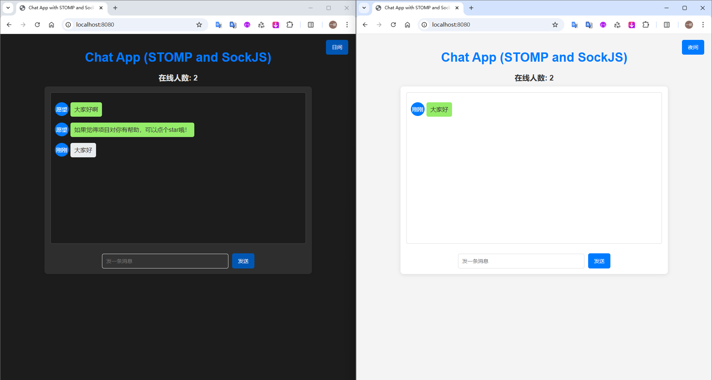

# socket-chat

>  一个基于 **Java**、**HTML**、**CSS** 和 **JavaScript** 开发的实时轻量聊天室应用，使用 **STOMP** 协议结合 **SockJS** 实现 WebSocket 通信。


## 功能特点

- **实时消息**：用户发送的消息会实时广播到所有在线用户。
- **用户名显示**：每条消息旁显示用户名，方便识别。
- **在线人数显示**：实时显示当前在线用户数。
- **日间/夜间模式**：提供日间模式和护眼的夜间深色模式，以适应不同的浏览环境。


## 技术栈

- **后端**：Java（Spring Boot，STOMP，WebSocket，JDK17，Thymeleaf）
- **前端**：HTML、CSS、JavaScript
- **WebSocket库**：STOMP.js 和 SockJS，用于消息处理和实时通信。


## 安装和配置

### 先决条件
- 确保你的机器上已安装 **Java17** 和 **Maven**。

### 安装步骤
1. **克隆仓库**
   
   ```bash
   git clone https://github.com/OnlyAPI/socket-chat.git
   
   cd socket-chat
   ```

2. **下载Maven依赖后直接运行 `ChatSocketApplication`  SpringBoot启动文件**
3. **打开浏览器访问：http://localhost:8080/**


## 项目截图

- 首页（需要输入昵称才能进入聊天页）

  


- 聊天页（日间模式）

  


- 聊天页（夜间模式）

  


- 多人聊天

  


## 说明

1. 聊天记录不会保存也不存在历史聊天记录，每次刷新浏览器会重新链接
2. 自己发送消息的背景色为绿色，目前是根据最开始输入的昵称区分，现在有个问题就是相同的昵称会有显示问题
3. 此项目为闲暇之余兴趣开发，这是个demo，没考虑消息安全等方面。请注意！
4. 如果觉得项目做的有点意思，还请大家多多star~~


## 鸣谢
- 感谢 [Xiumuzaidiao](https://github.com/Xiumuzaidiao/Day-night-toggle-button.git) 开源的项目。
